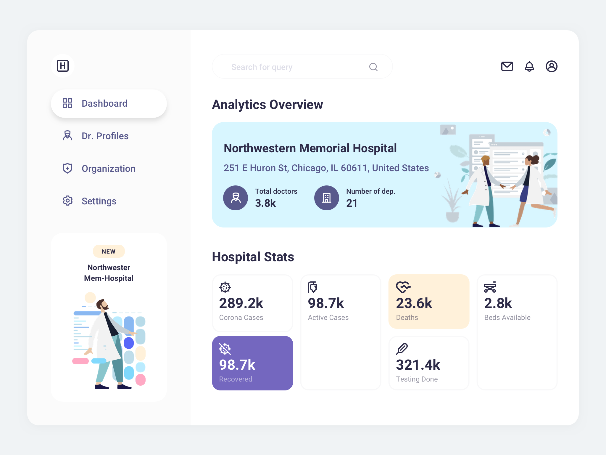

# Stream Hospital Dashboard

The app is created using [Vite](https://vitejs.dev/), React, TypeScript and an API to fetch data from. 

## Install and run

To install project dependencies, you can run `yarn`.
After that, you can run the application using `yarn start`. This command will run two scripts concurrently:

1. `yarn dev`
2. `node ./api/index.js`

The mock API should be available on `http://localhost:3005/hospital`.
